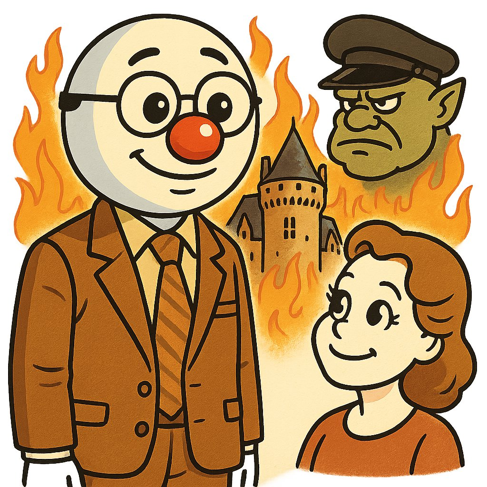

## TALK

### Me

Dessine philippe noiret dans le film le vieux fusil, seul, debout.
Son visage ressemble à un bonhomme de neige de style cartoon des années 80-90.
Il a une tête blanche arrondie, de grands yeux noirs brillants avec un éclat blanc et un sourire amical.
Il porte des lunettes. Son nez est une grosse boule rouge brillante.
A coté de lui, il y a romi schneider.son visage est dessiné dans le meme style.
Ils se regardent. a l'arriere plan, il y a un vieux chateau,
Un orc avec une casquette militaire noire à visière rigide,avec une forme arrondie et une calotte bien ajustée.
Il y a des flammes autour du chateau
L'ambiance est joyeuse et simple, avec un style rétro et enfantin, sans fond (fond transparent).

### AI

