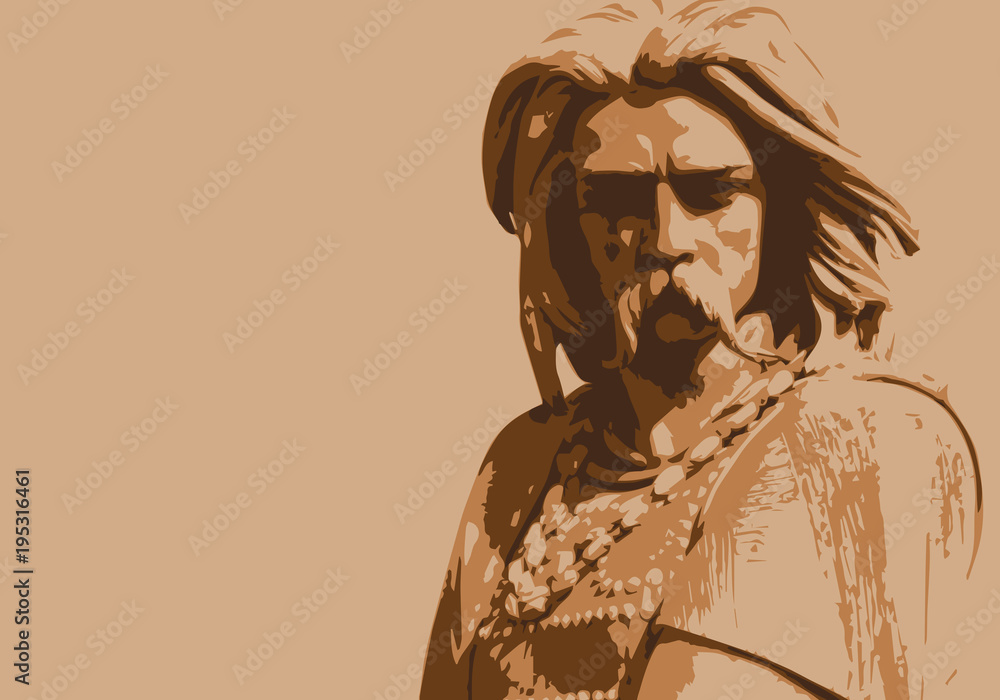
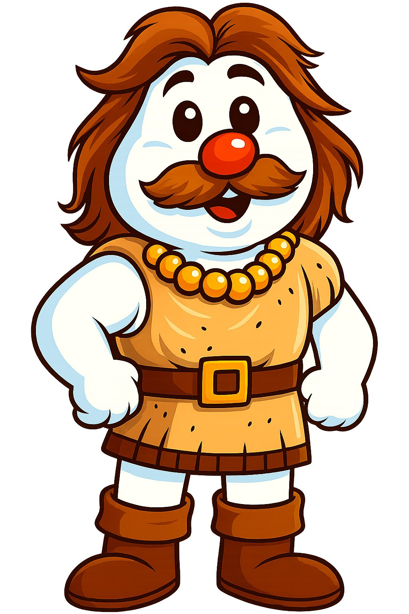

## TALK

### Me

Dessine vercingetorix, seul, debout. Il incarne le roi des celtes gaulois. On doit reconnaitre son visage, comme dans la piece jointe.
Pour le style, le visage ressemble à un bonhomme de neige de style cartoon des années 80-90.
La tête est grosse, blanche arrondie, de grands yeux noirs brillants avec un éclat blanc et un sourire amical.
Son nez est une grosse boule rouge brillante. Ses cheveux et sa moustache sont fournis. Il degage de la puissance
L'ambiance est joyeuse et simple, avec un style rétro et enfantin, sans fond (fond transparent).

### AI

