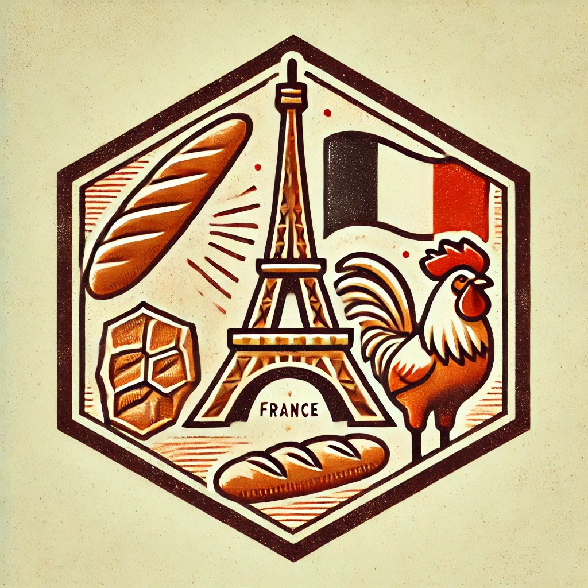
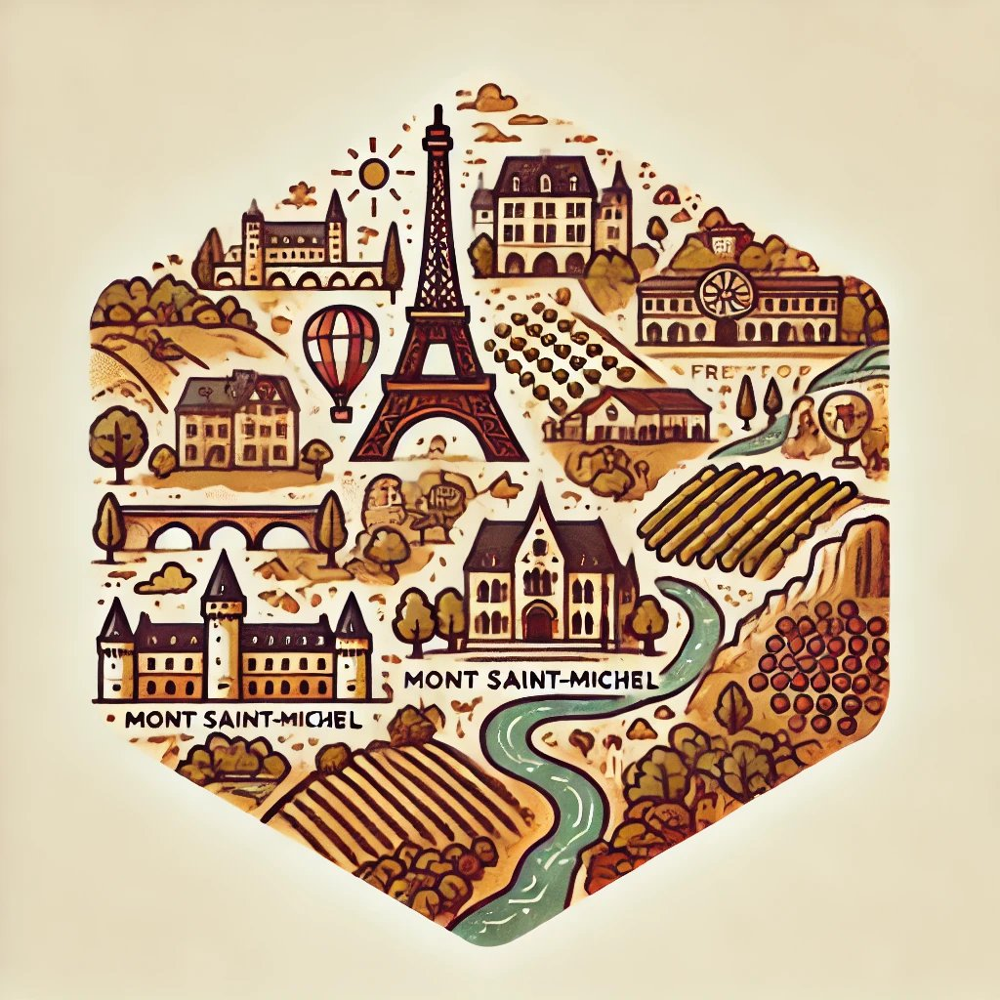

## TALK

### Me

dessine moi un symbole de la france en forme d'hexagone dans un style cartoon vintage

### AI

Voici ton emblème de la France en forme d’hexagone, dans un style cartoon vintage ! Il intègre des symboles classiques comme la Tour Eiffel, une baguette et un coq, avec des couleurs chaudes et une touche rétro. J’espère que ça te plaît ! 😊

### Me

dessine moi la france en forme d'hexagone dans un style cartoon vintage

### AI

Voici une représentation de la France en forme d’hexagone dans un style cartoon vintage ! Elle inclut des illustrations dessinées à la main de lieux emblématiques comme la Tour Eiffel, le Mont Saint-Michel et des vignobles, avec une palette rétro et chaleureuse. J’espère que ça te plaît ! 😊

